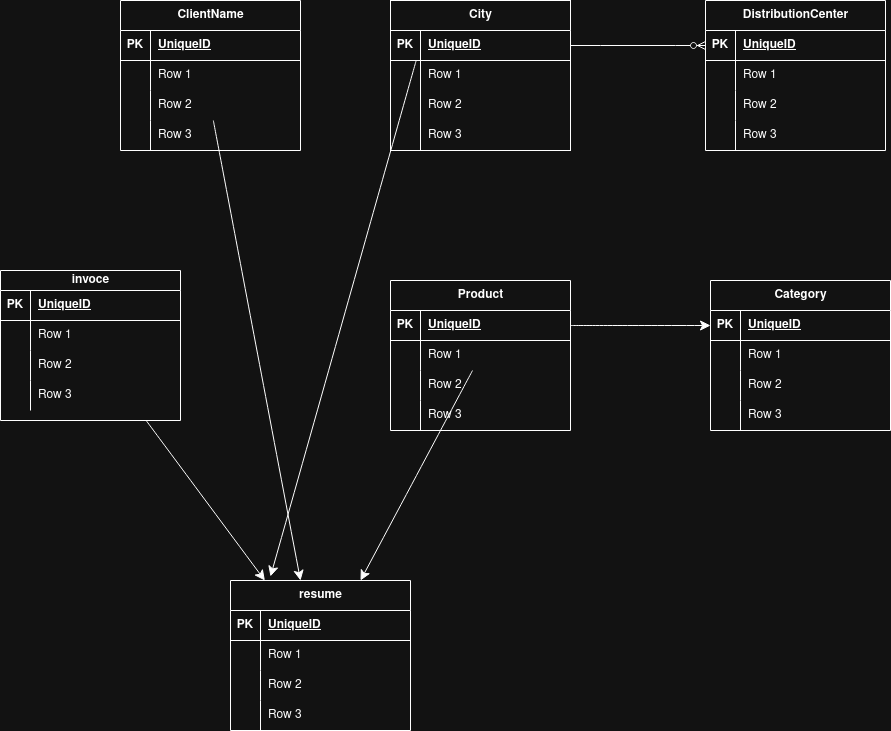

# Project description
EcoMarket Riwi S.A.S., is a company
dedicated to the marketing and distribution of fresh food for supermarkets,
restaurants and specialty shops in different cities of the country.
## Technologies
* Docker
* Visual Code Studio
* DataGrid
* Excel
## Database engine
* Postgres
## Normalization process
1. Clean the information 
2. Check not exist duplicate any row 
3. Do the differents tables depens of the column
4. Apply the thirds first NF

## Installations
1. Open Docker Desktop
2. Open de DB container in VS code
3. Open the terminal and write "docker compose up -d"
4. Open DataGrid and connect the DB with the credentials 
5. Start create the tables in public and fill it 
## Entity Relationship Diagram

## Database creation instructions
We had a docker container for create conect with datagrid 
## GITHUB

https://github.com/maandrea23/db_riwi.git

